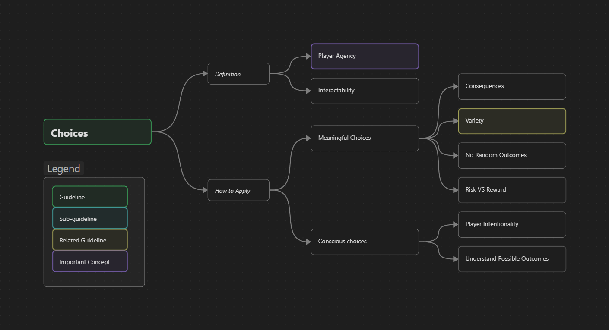

Game Design
{: .label .label-purple }

<h1>Choices</h1>

{: .warning }
This page is a Work in Progress

#### Guideline Overview
{: .no_toc }

----

## WIP Summary
{: .no_toc }
This refers to allowing the player to decide what type of activity they want to engage with, or what approach they want to take to face one task.
This is strongly tied with the *negotiation of goals*, where **player agency** is a key element that drives the experience.
Unlike cinema, literature, or other kinds of art, interactability (highlighted by choices) is what distinguishes games from the rest of the arts.
This is deeply entangled with many other concepts in these guidelines, such as *player motivation*, *variety*, **POIs**, and **Pathing**.
Choices have to be: 

### Meaningful
{: .no_toc }
For choices to be meaningful they have to have **consequences**, present a balance in terms of *risk VS reward*, the player has to have direct control over the action they are choosing (so no randomness involved), and options have to be *varied* enough for them to understand the differences of choosing one option over the others.

### Conscious
{: .no_toc }
This means that the player has to be aware of the action they are taking, and that they are willingly choosing to do so.
For this purpose, they have to know that this is a possibility the game presents and what the possible *outcomes* might be.
This is strongly related to how [Goals](./guidelineGoals.md) are implemented, following the same principles.
So two essential things are required: **player intentionality**, and **signposting**. 

----

**Page Structure**
{: .no_toc .text-delta }
1. TOC
{:toc}

# Description

## Definition

## What it achieves/focuses on

## How to Apply

## Counter Effects

# Real Industry Examples

# Metrics and Validation

# Related To 
