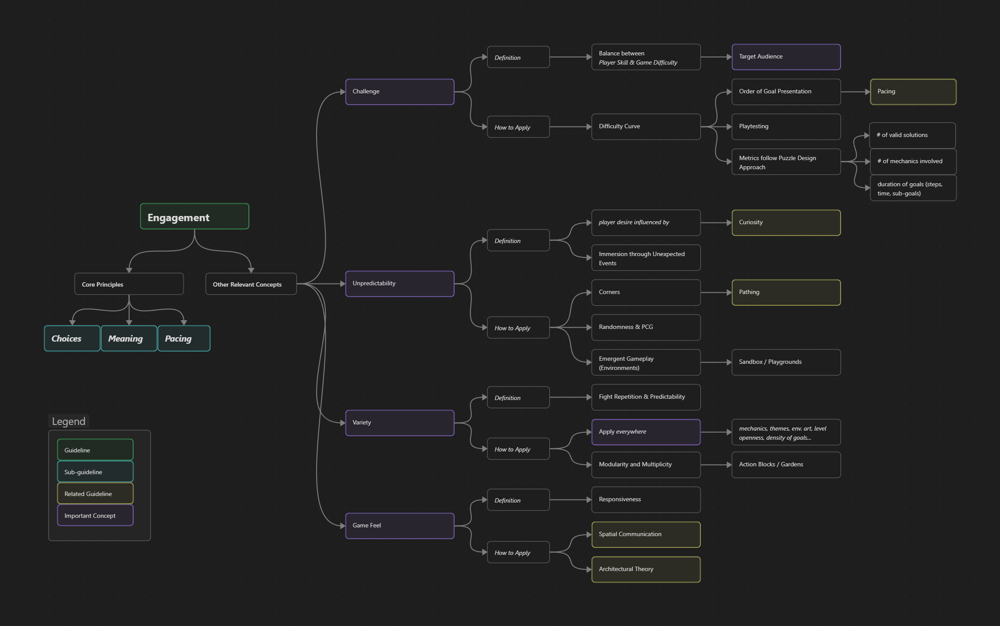

Game Design
{: .label .label-purple }

<h1>Engagement</h1>

{: .warning }
This page is a Work in Progress

**Page Structure**
{: .no_toc .text-delta }
1. TOC
{:toc}

#### Guideline Overview
{: .no_toc }

# Description
This guideline is quite dense, and it contains additional sub-guidelines for specific topics.
It provides a general definition of what engagement is constituted of, along with some brief introductions to the sub-guidelines.
It also contains explanations on some other shallower concepts.
While the description section will go over all of these concepts, the rest of the sections will only focus on the latter concepts, since each of the former already has a dedicated in-depth page. 

## Definition
Engagement describes how effectively a level or a game holds the player’s attention and motivates them to keep playing.
Engagement is built upon three major concepts.

### Choices
{: .no_toc }
This relates to *player agency*, where the player decides what type of activity they want to engage with, or what approach they want to take to face a task.
This is strongly tied with *goal negotiation*, a key concept that helps drive the intended experience.
Unlike cinema, literature, or other kinds of art, interact-ability (highlighted by choices) is what distinguishes games from the rest of the mediums.
Choices are deeply entangled with many other concepts in these guidelines, such as *player motivation*, *variety*, **POIs**, and **Pathing**.

### Meaning
{: .no_toc }
This term refers to the sense of purpose that players experience while playing. 
It consists of the feeling that what they are doing in the game matters, whether to the story, to other players, or to themselves.
Meaning can be born from **connections** of many kinds: cognitive (detecting patterns and solving problems), spatial (when meaning is embedded in spaces), personal (reflecting on ourselves), and emotional (attachment).  

### Pacing
{: .no_toc }
Pacing is the speed at which experiences unfold over time.
It defines how quickly events, information, or actions are presented.
Pacing can be measured in many different aspects of a game: narrative, challenge, mechanics involved, emotional charge, etc. 
A well-tuned pacing maintains **Curiosity**, focus, and emotional investment.    

----
Choices, Meaning, and Pacing are the main concepts that shape engagement in a game, but there are some other related concepts that are widely mentioned in the industry and that are worth looking at, since they form part of the vocabulary of players, game designers, and researchers alike.

### Challenge
{: .no_toc } 
This measures how difficult the presented goal is in relation to the skill of the player.
Games have to be designed with a **player base** in mind, but it is also a common practice to try to reach for broad audiences, in which tuning the challenge is a more difficult task.
An objective that is too easy for the player results in boredom or disinterest, while the opposite case can lead to frustration or even induce anxiety. 
A good **balance** of challenge helps maintain the player engaged with the different activities.

### Unpredictability
{: .no_toc }
This concept helps shape engagement by influencing the player's **Curiosity**.
It describes how the expectancy of the outcome of an event (e.g. not knowing how an entity can react to your presence) can get the player invested and create the *desire* to figure it out.

### Variety
{: .no_toc } 
This refers to the idea that a game should present a wide variety of elements to remain engaging. 
This concept can be applied in *every* aspect of a game: game mechanics, themes, environmental art, openness of a level, density of goals, etc.
A good variety can keep the experience of a game fresh and avoid repetitiveness.

### Game Feel
{: .no_toc }
This is an abstract and intangible concept that refers to a satisfying sensation experienced when playing games, which is usually linked to **responsiveness**.
This responsiveness reflects on the reaction the game has when a player performs an action.
It is best explained through an example.
If your game consists of pressing a button, this can be mechanically achieved by just reading the input from the mouse.
However, game feel explains how to transform this simple action into something engaging, by giving this click some visual and auditory impact.
This can be done through a satisfying clicking sound, animating the button bouncing with the click, adding particles and camera shakes, etc.
This concept is usually closely tied with game design or game art, but level design can have this kind of impact too.

## What it achieves/focuses on
All of these concepts have one goal in mind: to get the player to keep playing the game.
Players usually have a preconception of what the game is when they are engaging with it.
This means that they have an expectation of what the game experience is going to be, and they have some **motivation** to look forward to it.
These concepts reassure the player and keeps them interacting with the game.
Furthermore, a game is usually structured around fighting boredom and avoiding passivity.
There are some exceptions, such as narrative-driven games, where the only type of interactability is the dialogue options the player can choose from or *quick time events*.
However, these games still present the aforementioned concepts, but instead of through game systems they do so through narrative resources.

One side effect of challenge and unpredictability is the creation of *immersion*.
This refers to the flow state that players achieve on prolonged game sessions, where they fully engage with the game systems or narrative, and reality temporarily bends around the fiction they are experiencing.
This only happens when the player is fully engaged with the game, so this is the direct outcome of a successful application of the guideline.

Finally, both variety and unpredictability work together to boost the player's **Curiosity**.
This is a guidance technique that is deeply looked at in its respective guideline.
Variety can influence unpredictability by creating the idea in the player that, since they have already run into a wide selection of events or scenarios, new experiences might be around the corner.

## How to Apply
### Challenge
{: .no_toc } 
The first step consists of designing metrics to understand the challenge of our goals.
The approach can be similar to the one taken to measure difficulty in puzzle games.
There are different characteristics of our goals we can measure:

- *The number of valid solutions.* A reduced amount of solutions forces the player to follow specific steps, which increases the challenge posed. 
- *The number of mechanics involved.* Depending on your game and the number of valid solutions this can both reduce or increase the difficulty of your challenge. More mechanics can introduce complexity or flexibility, depending on the number of valid solutions.
- *The duration of the goal.* This can be measured in time, number of sub-goals, or number of steps. The longer a task is, the more challenging it becomes.

Once we have metrics to define the difficulty of our goals, we can sort them in ascending order.
A specific metric used to define this progression is the *difficulty curve*.
This curve can present different shapes and steepness across different games.
Purely narrative games with little to no fail states usually have a flat curve with low steepness, while more demanding games like in the *Soulslike* genre usually have a more pronounced curve.
The important consideration is that your curve matches the intended experience you want to provide.
Difficulty curves also have a strong connection with **Pacing**, where altering the progression of challenge can positively impact the experience of our game.
These curves do not necessarily need to be straight lines, they can have spikes.
These spikes, both hills and valleys, serve pacing and produce moments of tension and relaxation in the player's experience.

The organization of these goals in open spaces is trickier.
With the inherent freedom of these spaces the player can decide where to wander at any point, so we cannot lay out our goals in a linear way.
However, we can still trace paths by having *difficulty spikes*.
Letting the player access areas with tougher enemies can serve as a discouragement to approach such spaces before acquiring better gear or being more skillful.
This also encourages the behaviour of *backtracking* and visiting old areas they did not face before, which can also help them find missed content in the areas they did explore.
However, this difference in challenge has to be explicit through visuals.
Players should know the space they are approaching is more dangerous just by the themes and looks of it.
If that is not the case they might think that such is the intended path and then get frustrated due to them not being able to get through it.
Getting this balance right is not a trivial task.
This is one of the many reasons you should **playtest** your levels.
Getting feedback from potential players is more valuable than any textbook, since their experience is specifically framed in the context of your game, unlike this kind of guidelines or textbooks, which aim for a more general understanding of level design.

### Unpredictability
{: .no_toc }
One of the most common techniques to achieve unpredictability is the usage of *corners*.
These are a layout resource utilized to hide game elements behind sharp turns in your paths.
Although this is mainly a guidance tool that boosts **Curiosity**, this also serves the purpose of unpredictability, since players will not know what to expect.
It is important to let the player know where paths or game elements might be hidden, since the purpose of this tool is to eventually let them explore every piece of content.
In this sense, corners also serve as a **Pacing** resource, since they control the flow at which information is presented to the player so that it is more digestible.

Another more explicit and straightforward tool to integrate unpredictability in a game is through the usage of *randomness*.
This can be applied to many different aspects of a game, determining, for example, the type of enemies to find in a dungeon, rewards of different value, and even the mechanics required to achieve a specific goal.
In the context of level design, this is specially common in rogue-like games, where the layout of the dungeons, the loot, and the enemies found is different in every run.
The implementation of this randomness in these more complex scenarios is done through *procedural generation algorithms*.
Some example algorithms include *Random Walk*, *Wave Function Collapse*, and *L-systems*.

One more uncommon practice is the usage of *emergent gameplay*.
This is achieved through the design of game systems and mechanics that have a high interoperability with each other, which is then further expanded by not explaining the player all these types of interactions, and expecting them to explore these on their own.
The role of level design in emergent gameplay is providing the space where this exploration happens.
There are two types of spaces for this purpose: *sandbox* and *playgrounds*.
Both present similar definitions: they define a play space where the player can explore the different systems the game presents.
However, there is a subtle difference, playgrounds have these systems embedded into their space, while sandbox spaces just provide the empty space.
One example to follow is *Minecraft (2011)*, where even when world generation is an infinite flat plane, the player can use this space to play.
On the contrary, a playground example would be *Sunset Overdrive (2014)*, where the space is populated with zip-lines and rails the player can grind to quickly move around while fighting hordes of enemies.

### Variety
{: .no_toc }
One approach to create variety that is widely applicable and easily translatable to level design is through the concept of *modularity*.
This concept refers to the creation of modules, or blocks of content, which then can be combined in many different ways to create different experiences.
In game design this is achieved through the interaction of different mechanics and systems.
Level design works in the same way, but instead they define these modular pieces as *action blocks*, where each piece represents a simple idea on how to interact or traverse a level.
This is specially powerful combined with procedural generation. 
Encoding random permutations of these modules is a widely researched topic.
However, these modules are usually created by hand, and the implementation of the algorithm requires level design insights to follow specific design principles such as **Choices** or **Pathing**. 

One specific consideration is that the concept of variety can be applied to every aspect of a game.
- *Level art*: biomes, themes, types of obstacles...
- *Pathing elements*: branching, funnelling, vistas, backtracking...
- *Game mechanics involved*: resource gathering, combat, platforming...
- and even challenge can serve as an example that presents with strong variance.   

Remember that level designers act as the architects of games. 
They decide in what way to assemble all these pieces together, so that these align with the intended game experience.

### Game Feel
{: .no_toc } 
In terms of level design, game feel can be explored from the sensations the different spaces create on the player. 
As explored in following guidelines, *architectural theory* [[Spatial Structures](../3.SpatialCommunication/guidelineSpatialStructure)] can explain how these spaces have an emotional influence with different shapes and scales.
In the same sense that aesthetical elements achieve game feel in simple mechanics, level design can enhance the type of experience the game wants to provide.
For example, specific movement mechanics like the ones we find in *Mirror's Edge (2009)* convey different sensations when applied in open spaces or in tight corridors.
Sharp edges can convey a sensation of danger, while smooth shapes allow for a more organic environment where players might feel safer. 

## Counter Effects
- **Challenge**:
If the difficulty does not match the intended or expected experience it feels unfair rather than engaging.
Players will no longer read it as a fun challenge, but rather as *friction* that gets in the way of what they came for.
This can be in a global sense, where the overall difficulty does not match the expected experience, but it can also happen in set moments in the game, where a spike in difficulty or a valley can discourage players from going forward, since they might feel the burden is not worth their time.

- **Unpredictability**: 
A game that is too predictable is going to lack **Curiosity**, which is a key concept that drives the player throughout the experience.
On the other hand, systems that are too unpredictable or overly random make it hard for players to learn, anticipate, and strategise.
When their attempts to understand the game never pay off, it feels incoherent and discouraging instead of mysterious or deep.

- **Variety**: 
On the same note as the previous point, overly repetitive encounters, mechanics, or rewards quickly drain excitement.
Without a steady sense of novelty or progression, the objectives the game presents may start to feel like chores instead.

- **Game Feel**:
Weak or absent game feel (no satisfying feedback, weight, impact, or responsiveness) turns otherwise solid mechanics into bland interactions. Even good ideas can feel lifeless when every action feels flat, floaty, or unresponsive.

All together, neglecting these elements does not simply make an experience slightly worse, but it directly contributes to frustration, boredom, emotional detachment, and ultimately players abandoning the game.

# Real Industry Examples
### Challenge
{: .no_toc } 
An example of a game that has been called out for having a bland and dull difficulty curve is *Hogwarts Legacy (2023)* due to its challenges feeling too linear and scripted.
It aims for a broad target audience by lowering the difficulty bar, making it a less exciting experience, specially in the moments the narrative demands it.

On the contrary, *Celeste (2018)* has a solid progression.
It slowly introduces new mechanics and evolves them over time, combining them to increase complexity and challenge.
It paces out the challenge by having narrative beats scattered around the levels, and difficulty spikes on specific rooms.
It also uses open spaces and branching so that the player can decide what room to approach next, rewarding exploration and completion of more difficult rooms.

Another example of a game with an imbalance in its difficulty was *Hollow Knight: Silksong (2025)*.
At its release, this game presented an extreme challenge for newcomers, since most of the environmental hazards and the tougher enemies would deal double damage in the early game, which means players would perish in 3 hits while still learning the basic mechanics.
This was solved in one of the first patches, acknowledging the existence of the issue.

Talking about *soulslike* games is tricky, since they already have a high bar of difficulty on entrance, but players already expect this.
With this high bar in mind, *Elden Ring (2022)* presents an open world where the player can decide where to go at any point.
However, the difficulty of the areas is easy to read, and players can decide by themselves if they want to approach harder challenges earlier than expected.
Such is the case of 'Caelid', a mid-game area that is pretty close by to the beginning of the game.

### Unpredictability
{: .no_toc } 
Pretty common examples of games that have a good implementation of unpredictability belong to the *rogue-like* genre, such as *Noita (2019)* and *The Binding of Isaac (2011)*.
These games have a good integration of randomness, in a way that they drastically affect gameplay, without taking away control from the players from achieving their goals.

On the contrary, games like *Rain World (2017)* and *XCOM 2 (2016)* have randomness mechanics that can definitely determine if the player is going to succeed in their goal.
Getting some creatures spawn in such a way that they corner you in a room, or missing a close-range shot to an enemy you exposed yourself to can quickly end your game and enjoyment.

### Variety
{: .no_toc }  
A very explicit implementation of variety is through visually distinct regions.
This is present in most traditional open-world games, like *Subnautica (2018)*, *Elden Ring (2022)*, and *Zelda: Breath of the Wild (2017)*.
Other games that offer more realistic environments like in the *Grand Theft Auto* series present this variety in a different way.
The structure of the city roads, the business area, the suburbs, or coastal areas differ both in looks and in gameplay experience.

Modularity is a concept that is more easily attributed to *rogue-likes*, where specific rooms and enemies offer variation by the distribution and subtle differences in looks and behaviour.
This is the case of *Enter the Gungeon (2016)* or *Dead Cells (2017)*.

### Game Feel
{: .no_toc } 
This characteristic of games is harder to define and diffuse to point out, but some examples of wonderfully implemented environmental storytelling are *Horizon Zero Dawn (2017)* and *The Last of Us (2013)*, where different displays of scenes, corpses, and NPC interactions portray narrative bits.
In particular *The Last of Us* uses openness, light, colours, sound, and layout to convey specific sensations to the player, at the same time it drives narrative and tension.

# Metrics and Validation

### Challenge
{: .no_toc } 
This is usually analysed with the difficulty curve, which evaluates the increase of challenge throughout the progression of the game.
The skill set of the expected player base can be put in perspective with this graph, having five distinctive regions.
When the skill surpasses the challenge the player can feel bored or even apathy if the difference is too extreme.
In the opposite case, the game can feel too demanding and the player can feel frustration or even anxiety.
When the challenge is just right, where it is demanding but not infuriating, the player can enter the flow state.

### Unpredictability
{: .no_toc } 
You can measure this aspect of a game by analysing the randomness integrated in your gameplay.
You can also measure the distance and number of occurrences of corners, where the player is subtly guided to small hidden pieces of levels.
A measure of validation is to make sure not all the required information is presented at one, let the player explore and find all the bits of game knowledge in small steps.

### Variety
{: .no_toc }  
In the case of working with modularity, you can mathematically calculate the number of permutations or combinations these modules present.
Go through all your conceptual tools and assert you have some kind of variety where needed, these conceptual tools referring to the different **Pathing** and level design resources presented in this text.

### Game Feel
{: .no_toc } 
The best approach to ensure the game feel is right is through playtesting.
Hand out the controller to your colleagues and ask them how do the controls feel in the space you created.
What kind of sensations or thoughts come to their minds while experiencing such parts of the game.
This process can also be carried out through public testing.

# Related To 
### Engagement: Choices, Meaning, Pacing
{: .no_toc }
These are the three main pillars that define engagement.
Each guideline explains in detail what each concept means, how to apply it, and real industry examples and metrics.
Choices are related to challenge, unpredictability and variety.
Meaning is related to game feel.
Pacing is related to challenge and variety.    

### POIs
{: .no_toc }
Variety is an intrinsic characteristic of points of interest, and how their frequency should be inversely proportional to their relevance.

### Curiosity
{: .no_toc }
Curiosity can be born from unpredictability.
Players not knowing what to expect get the desire to figure out what the game is hiding from them.

### Spatial Communication
{: .no_toc }
This dictates what the player is going to be able to read from their surroundings, which helps in the context of unpredictability.
It helps keeping a balance by letting the player have enough information for them to wonder about the outcome of some events, so that hey are not completely unreadable.

### Spatial Structure
{: .no_toc } 
The spatial structure of your game determines in what order the player finds the different objectives, and that explicitly defines the challenge progression the player is going to face.
The shape of the space also provides a specific game feel through *architectural theory*.
