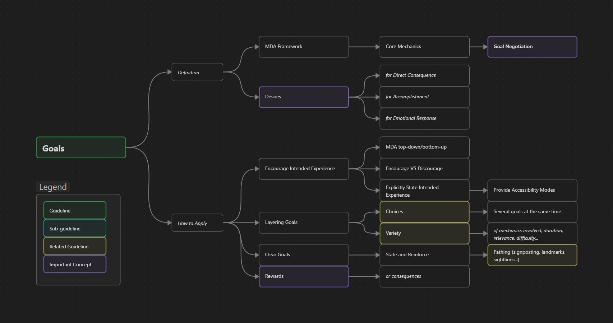

Game Design
{: .label .label-purple }

<h1>Goals</h1>

{: .warning }
This page is a Work in Progress

**Page Structure**
{: .no_toc .text-delta }
1. TOC
{:toc}

#### Guideline Overview
{: .no_toc }

# Description

## Definition
Goals refer to any objective or activity the player has to perform that comes from the **desire** to achieve something in the game.
These goals can be presented by the game or can be self-imposed by the player. 
The 'conversation' the player has with the game to discuss which goals are viable through the game's systems is called **goal negotiation**. 
Goals are in charge of providing the players a reason and/or examples to use the **core mechanics** the game systems offer. 

Goals can arise from several types of desires.
These desires can overlap, since objectives can be born from multiple desires at once.
There are three types of desires:

- **Desire of a direct consequence of performing an activity.** 
  This could be any type of action where the player would get a reward or achieve something in exchange of performing a task. 
  This desire also applies in the scenarios where players do not know what the consequences of their actions might be, supporting the [Curiosity](../docs/Guidelines/2.Guidance/guidelineCuriosity) guideline.
  Some examples include: fighting enemies to level up, gathering resources, building the defences of a base, or progressing the narrative. 

- **Sense of accomplishment for successfully performing a task.**
  This is usually related to challenges and mastery of the mechanics.
  This type of desire includes tasks such as defeating a difficult boss, climbing a ridge, gathering all collectibles, or even completing the game without receiving damage.

- **Desire of direct emotional response.**
  This is explained by players seeking specific emotions when performing actions, such as climbing a ridge to watch a sunset, or fighting enemies because they enjoy the combat mechanics.
  This can also be seen from a more cognitive or personal level, where players might act in specific ways drawing the magic circle closer to reality.
  This can be the case of being kind to NPCs or following the traffic rules in a *GTA* game.

As you can see, the same action (e.g. fighting an enemy) can come from different types of desire.
The player might want to gain experience, they may want to prove to themselves they are capable of defeating such enemy, or they might just enjoy the combat mechanics.
Designers should seek how to motivate the intended behaviours through these types of desires.

While game designers and narrative designers form the core of goal definition, the discipline of level design plays a critical role in shaping how goals are communicated, implemented, and ultimately experienced by the player.
Particularly, level designers are in charge of distributing these goals in such a way so that they align with the *intended game experience*.

## What it achieves/focuses on
This guideline is strongly tied with the MDA framework.
Goals (which are enabled by mechanics), *motivate* behaviour (dynamics), which then *evokes* emotions and feelings (aesthetic).
This is one of the most relevant guidelines, since this ***negotiation of goals*** is the main driver of the **experience** the player will have with the game.  

## How to Apply
### Seeking the intended experience
{: .no_toc }
One approach game designers have to bring game experiences to life is following the **MDA framework**.
This can be done by first thinking about the mechanics, which then enable dynamics and evoke the aesthetics.
The process can also be applied in reverse, where designers first seek a specific aesthetic, and then think what type of behaviours and mechanics would contribute to that experience. 

It is important to note that when designers are working towards an intended player experience, it is better to **encourage** a wanted **behaviour** rather than disabling an unwanted one.
This is because the coerced freedom of the player can be perceived as an obstacle to play however they want to.
There is an open debate in the industry whether designers should impose their intended experience to players or not.
This has been a hot debate with topics like the difficulty of the *FromSoftware* games. 
One specific example is *XCOM2 (2016)*, a turn-based tactics game where some levels would present a maximum number of turns to *enforce* a more risky playstyle.
Many players did not enjoy this restriction, since they preferred playing in a way where they could minimize risk.
This feature was so disliked that the community implemented mods to overcome this restriction.

One way to deal with this discussion between players and designers is to clearly state what the intended experience is without forcing the players to follow it.
This can be done through accessibility modes as it is seen in *Celeste (2018)*, where you can enable settings like infinite dash or no stamina consumption, and *Satisfactory (2019)*, where you can completely disable the enemies hostility.
However, this should be more of a last resource, since they can bring to the table more development time.

> "One of the responsibilities I think we have as designers is to protect the player from themselves"
> ~Sid Meier

> "[...] given the opportunity, players will optimize the fun out of a game." 
> ~Soren Johnson

These quotes point to the idea that players might decide to play a game in a specific way that is less fun just because it guarantees success with a goal, or simply because that is a faster method.
As a designer make sure that, whenever you are seeking an intended experience, do it in such a way that minimizes the possibility to run into these scenarios.

### Layering Goals
{: .no_toc }
*Player Agency* is vital to most game genres.
This is achieved through [Choices](../1.GameDesign/guidelineChoices).
In relation to goals, this is done through presenting several goals at the same time, so players can choose which one to engage with.
These goals should present some *[variety](../1.GameDesign/guidelineEngagement)* so that the choices the player makes are meaningful.
This variety can be applied in several ways: core mechanics involved, duration (long/short-term goals), relevance (main/secondary missions), and difficulty, among others.

### Clear Goals
{: .no_toc }
This refers to the need of explicitly stating to the player what are the current goals, and frequently reminding them about their existence and purpose.
Although games with an open-ended nature allow for a broader selection of goals, players usually need some guidance to not feel completely lost.
One great example is *Outer Wilds (2019)*, where developers learned through playtesting that they needed to make sure to clearly present their soft goals at the beginning of the game. 
Another example of implementation is *landmarks*, which can tie a visual level element to progression, and then it gets presented frequently in the *sightlines* of the player.

### Rewards
{: .no_toc }
Goals have rewards.
The player needs to feel some accomplishment after achieving a goal, and this is done through rewards.
These can be framed from the definition of *desires*, where every goal is born from the desire to achieve something.
These can be explicit such as leveling up, progressing in the narrative, or defeating a tough enemy; or they can be more abstract, such as fulfilling their [Curiosity](../2.Guidance/guidelineCuriosity) or expecting a specific emotional reaction.
It is fair to say that players' self-imposed goals are more difficult to account for but, as designers, we should try to cover as many plausible desires as possible to the extent of our capabilities and resources.    

## Counter Effects
The negotiation of goals is a key element of level design.
Too few options can lead to restrictive gameplay and make the game feel too linear.
Beware of the opposite as well, too many goals can become overwhelming and players might lose track of the more important ones as their attention gets diverted into less interesting tasks.

# Real Industry Examples

### Intended Experience
{: .no_toc }
You can achieve the effect of encouraging specific playstyles (and hence enabling intended experiences) by using clever game and level design tricks.
One such example is *Doom (2016)*, where they designed the game for a more aggressive playstyle where the player should always be in a rampage of violence.
In this game they implemented the 'glory kills', a mechanic where killing demons using a melee attack rewards the player with health packs and ammunition.
Another example is *Bloodborne (2015)*, where the 'rally' mechanic allows the player to regain some health they just lost if they become more aggressive and hit back the enemy that just damaged them.
One last example is the *Uncharted* series, where enemies can destroy the player's cover by throwing grenades if they are playing it too safe.

### Layering Goals
{: .no_toc }
*Zelda BOTW (2017)* always presents many different objectives simultaneously, such as enemy camps, shrines, areas to gather resources (e.g. hunting or fishing), villages, wandering NPCs, stables, etc.
As a counter example, *Zelda Skyward Sword (2011)* presents only the main goal overlaid with a few lesser secondary tasks such as bug hunting.
The different opinions of this second game have been controversial.
Many people have deemed it to be too linear, since it does not present many chances to choose what to engage with in its world.

### Clear Goals
{: .no_toc }
The *The Last of Us* series (2013, 2020) always conducts players to specific locations, and they make sure to explicitly state this at the beginning of each level.
This is clearly marked and **reinforced** through the level with a *landmark* pointing at the destination (e.g. the museum, the bridge, the science building, the hospital, etc.).
One example of a game that does not present clear goals is *Sable (2021)*.
This game gives the player **absolute freedom** after the tutorial area is completed.
The player is given the soft goal of getting one specific key item from anywhere in the world, and then they can decide to come back to finish the game or continue exploring on their own.
Although the premise of complete freedom to explore different cultures and civilizations can be intriguing, many players showed discontent towards this game since there was no apparent reason for them to do so.    

### Rewards
{: .no_toc }
Another problem *Sable (2021)* had was underwhelming rewards after completing the different goals, which could make players feel discouraged from seeking more activities in its open world.
As a counter-example, *Outer Wilds (2019)* managed to reward players that showed curiosity by providing them with answers to their mysteries, and unlocking new investigation threads and mechanics to use on further expeditions. 

# Metrics and Validation
Create a list of all your explicit goals, and how they belong to the game chronologically and spatially. 
With this, you can run an MDA analysis over your main and secondary goals.
See what systems are involved and playtest how players react to those to see if they align with your intended experience.

You can also compare how many possible goals players have at their disposal throughout the game both timely and spatially.
You could aim to have a main goal, a few secondary ones, and lesser goals distributed sparsely.
Go through the list and make sure every goal has a reward or a reason to be completed. 
Players can find it very frustrating to complete a task without being rewarded afterwards.

Ensure you have some means to remind the player of where they can find or follow their goals.
This can be done, for example, through a notebook used as a registry (*Zelda Majora's Mask (2000)*), or by spreading NPCs across the land to talk about the relevance of those tasks (*Zelda: Tears of the Kingdom (2023)*).

# Related To 
- **Game Design - Engagement, Choices, Meaning, Pacing**. 
    Goals are responsible of providing the player with a gameplay experience through a display of the **core mechanics** and systems.
    Layering of goals should offer variety, risk VS reward, and choices.
    Rewards can act as consequences of choices.
    Goal negotiation is the main conductor of pacing, dictating which type of interaction the player can have with the game at any point.
    Furthermore, layering goals allows players to self-pace their game sessions.
- **Guidance - POIs**.
    POIs are a great source of goals, both presented by the game and self-imposed by the player.
    e.g. a player sees a *landmark* in the distance and decides to go there, which leads them to find an NPC that provides a quest.
- **Guidance - Curiosity**.
    Goals can arise from the player's desire to satisfy their curiosity.
