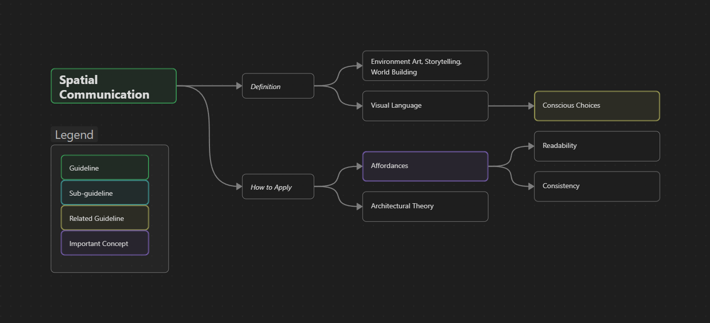

Spaces
{: .label .label-red }

<h1>Spatial Communication</h1>

{: .warning }
This page is a Work in Progress

#### Guideline Overview
{: .no_toc }

----

## WIP Summary
{: .no_toc }
This guideline explains how we can transmit information to the player with the different layouts we use to construct the spaces.
This guideline is strongly influenced by storytelling, environmental art, and world building.
In this sense, a level designer has to be informed and have active discussions with the different roles in the development team to successfully transmit this vision to the player.
The concept used to explain how to communicate with the player is the *visual language*.

This type of implicit communication is implemented through *affordances*.
These are recurring level elements or interactions that inform the player how future interactions with the game might be.
A proper implementation of affordances implies the player will be making *conscious* [Choices](../1.GameDesign/guidelineChoices).
For this, affordances have to be both *readable* and *consistent*.
The player can find satisfaction both from confirming their expectations or them being subverted, but we have to be careful with the latter for the levels to be readable and not feel random.
Readability is a concept that is also important to apply to our spatial structures.

----

**Page Structure**
{: .no_toc .text-delta }
1. TOC
{:toc}

# Description

## Definition

## What it achieves/focuses on

## How to Apply

## Counter Effects

# Real Industry Examples

# Metrics and Validation

# Related To 
