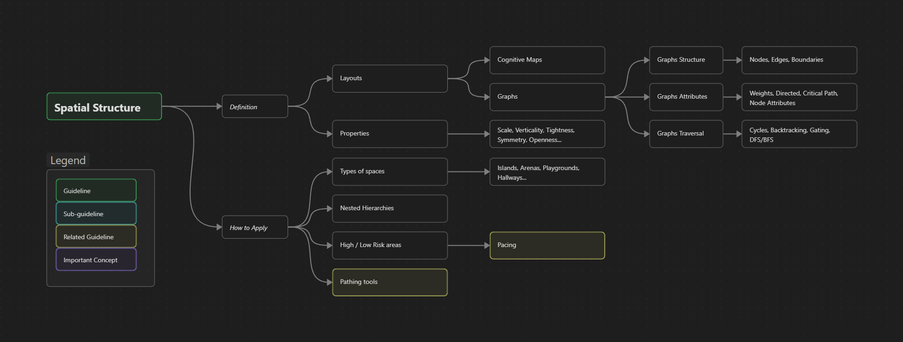

Spaces
{: .label .label-red }

<h1>Spatial Structure</h1>

{: .warning }
This page is a Work in Progress

#### Guideline Overview
{: .no_toc }

----

## WIP Summary
{: .no_toc }
The spatial structure describes the different shapes and attributes our space can have, and what influence they have on the player sensations.
These spaces can have different properties that define them, like scale, verticality, openness, tightness, symmetry, etc.
Making readable and comprehensible layouts for our levels help the player create *cognitive maps*, which are the mental representation they have of the space.
A specific way to play with these cognitive maps is by getting the player lost so that later when they find the way back they can connect in their heads how these spaces are structured.
            
In a more practical sense, layouts can be conceptualised as graphs.
These are structures that describe locations or level elements as nodes, and the paths between these as edges.
*Boundaries* are implicitly defined through the lack of edges between nodes.
- These graphs can be structured in a hierarchical way, e.g. the arrangement of towns in a game form a graph, but then every single town has its own sub-graph. This hierarchical structure is instinctively created in the cognitive maps of the players.
- Graphs can have attributes. These can be assigned to the edges, such as the distances or difficulty of traversing them, or they can be assigned to the nodes themselves, informing the value of these locations.
- Graphs can be directed or undirected, i.e. edges may only be traversed in one direction.

The structure of the graph translates into different **Pathing** tools that make interesting playable spaces, like *cycles*, *backtracking*, *shortcuts*, *choke points*, and *gating* among others.
Graphs are also a useful tool to validate the existence of a *critical path*.
Spatial structures are an implementation of all the theoretical concepts explained in these guidelines by making use of all the practical **Pathing** tools.
Here is where we implement sightlines, uncertainty, variety, choices, pacing, breadcrumbs, points of interest, and more.

----

**Page Structure**
{: .no_toc .text-delta }
1. TOC
{:toc}

# Description

## Definition

## What it achieves/focuses on

## How to Apply

## Counter Effects

# Real Industry Examples

# Metrics and Validation

# Related To 
