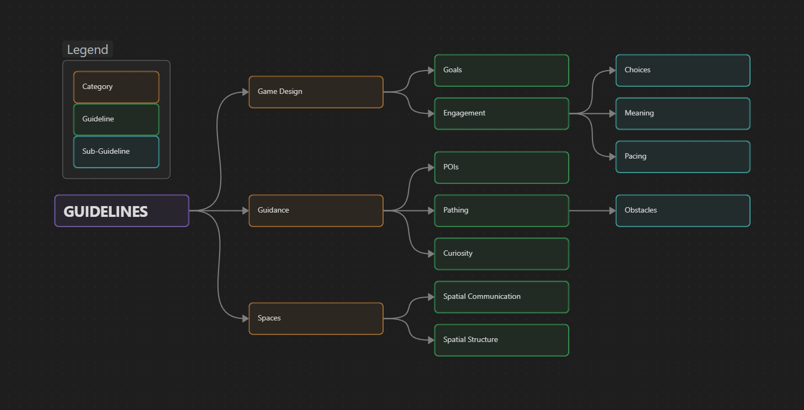

Here is a proposed definition for level design:

{: .highlight}
"Level design describes the practice of shaping spaces and distributing game elements to communicate interaction affordances and guide the players throughout an intended game experience."

From this definition we can highlight three parts: *shaping spaces, guide, and game experience*.
These are used to divide the guidelines into three categories: **game design**, **guidance**, and **spaces**.

While game design is considered a different role within the industry, its close interaction with level design requires some guidelines to be defined. These guidelines define concepts that belong to game design, but their practical implementation is explored from a level design perspective. 

Then, the guidance category presents tools and theory that can be used to influence the player's behaviour and desires, while the spatial category explains the overall structure of spaces and how to create them.

#### Guidelines Overview
{: .no_toc }

