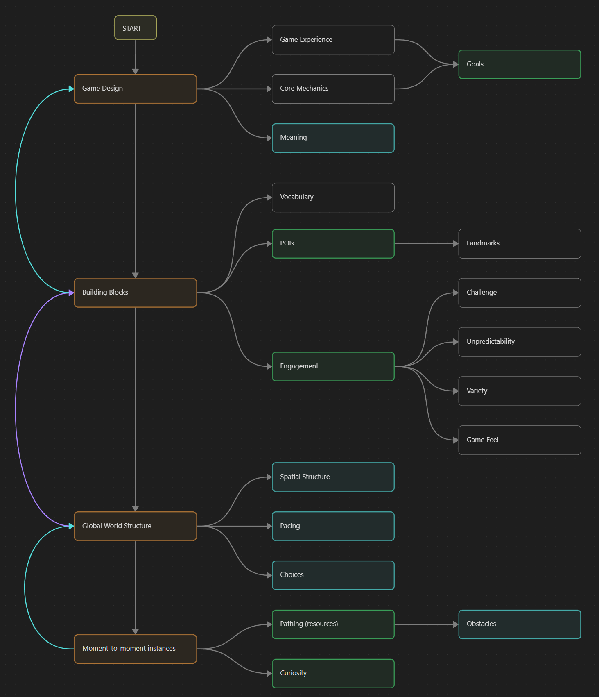

To better understand this section you should be familiarized with the guidelines and key concepts.
This section lists the guidelines in a possible order of consideration to develop a game.
However, this is not the only possible approach, since depending on the needs of your game and your development team priorities might they have to be rearranged.

Furthermore, remember that the development process should follow an iterative paradigm, and although things are presented in a linear progression, every concept should be revisited and verified when needed.
Additionally, this proposition also requires to work in parallel with game design, implementation, and/or playtest at every milestone.
Finally, bear in mind that the guidelines are by no means universal rules that everyone should follow.
Remember that ``... the creative goals of a game should shape the process of creating it''[^1], so the designer intent and artistic vision should be the ones to listen first.
With all this, we can have a look at the four distinct phases that level design can iterate through:

# Production Pipeline

## Game Design
In this phase you have to first design your **game experience**.
Decide what is it that you want your player to do and feel, and design your **core mechanics** accordingly.
With these you can start thinking about what are going to be your major **goals** and some candidate secondary or lesser goals.
As a level designer, you can also think about what kind of *connections* you want the player to have with your game, investing it with **meaning**.
This concept should be revisited to ensure it is properly implemented.    

## Building Blocks
This phase consists of deciding (and maybe starting to implement and playtest) what your building blocks are going to be.
You can start by constructing tools for your **vocabulary**, such as identifying what objects are interactable or not, or what surfaces are intended to be walked on, or how something looks like if it is out of bounds.
Additionally, you can work on your different **points of interest**, accounting for different levels of scale and relevance, and deciding how frequent or rare they should be.
Along with these, you can also come up with the principal **landmarks** that are going to serve the player for their *cognitive maps*.
To help you design these points of interest you can make use of the **engagement** guideline, which explains how to implement challenge, unpredictability, variety, and game feel.

## World Structure
This is the phase where you work on your first layer of your **spatial structure**.
Here you decide where to place your *landmarks* and regions, start organising *sightlines* and roads that connect the different parts of your world, and start setting up the **pacing** and **choices** by laying out your *points of interest* following specific spatial patterns.        

## Gameplay Instances
Once you are done with the overall structure of your world, and the building blocks are ready to be used, you can begin to put in place your moment-to-moment experiences, following all the **pathing** tools explained in the guidelines, and setting up your **obstacles** and boundaries.
Here is the perfect place to implement **curiosity** by making use of all the theoretical and practical tools explained in the guidelines.
You can use *denial spaces*, implement *breadcrumbs*, make use of *spatial lures*, organise *vistas*, and implement *signposting* through *sightlines* or other means.

--- 

This list of phases explains a top-down approach, where major structures and goals are first defined, and then designers and developers implement finer details until the moment-to-moment experiences are integrated.
The inverse approach is also possible, where you come up with specific gameplay bits, and construct upon them and merge them to create larger and larger experiences until your game includes all these bits of gameplay.
No approach is better than the other, just remember that which one is best fit for you depends on what type of game you want to build.

--- 
[^1]: See [Level design planning for open-world games](/docs/references/#LevelDesignPlanning) in the References